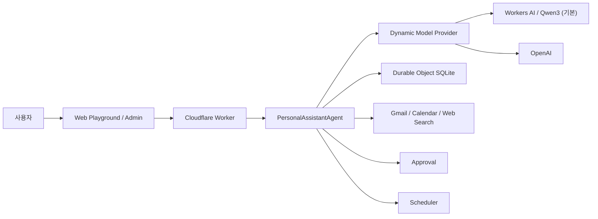

# Jarvis

Jarvis는 Cloudflare Agents 기반의 단일 사용자 개인용 AI 비서입니다. 자연어 대화, 메모리,
외부 도구, 사용자 승인, 예약 실행을 하나의 Agent Runtime에서 처리하며 Web Playground와
관리자 콘솔을 통해 기능을 검증하고 관리합니다.

## 현재 구현 상태

| Phase | 기능 | 상태 |
| --- | --- | --- |
| 1 | Cloudflare Worker, PersonalAssistantAgent, Durable Objects + SQLite, LLM | 완료 |
| 2 | Web Playground, Debug UI, 브라우저 STT/TTS | 완료 |
| 3 | Conversation, Profile Memory, Long-term Memory | 완료 |
| 4 | Gmail, Google Calendar, Web Search, Google OAuth | 완료 |
| 5 | Approval System과 Gmail/Calendar 쓰기 도구 | 완료 |
| 6 | One-time/Recurring Scheduler와 실행 기록 | 완료 |
| 7 | Admin Web | 완료 |
| 8 | iPhone / Apple Watch Thin Client | 예정 |

## 프로젝트 구조

```text
jarvis/
├─ api/       Cloudflare Worker, Agent Runtime, Tool, Memory, Approval, Scheduler
├─ web/       Agent 개발 및 검증용 Web Playground
├─ admin/     Jarvis 개인용 관리 콘솔
├─ swift/     향후 iPhone / Apple Watch 클라이언트
└─ docs/      PRD와 아키텍처 문서
```



기능 범위와 개발 기준은 [PRD](docs/Cloudflare_Personal_Assistant_MVP_PRD_v1.md)를 따릅니다.

## 주요 기능

- Workers AI Qwen3를 기본으로 하고 OpenAI로 런타임 전환 가능한 자연어 대화와 Tool Calling
- Gmail, Calendar, Search의 runtime-selectable Tool Provider와 SQLite 설정 영속화
- 대화 기록, 프로필 및 장기 메모리
- 사용자 위치와 timezone을 반영한 요청 처리
- Gmail 조회·검색·상세 조회
- Google Calendar 일정 조회
- Brave Search와 SerpApi 제한적 fallback
- Gmail 발송·답장과 Calendar 생성·수정·삭제에 대한 승인 정책
- 일회성 및 반복 Agent 작업 예약
- Tool, Approval, Schedule 및 Agent 실행 기록
- 답변 톤, 말투, 상세도와 사용자 지정 답변 지침
- Web Playground의 Tool Debug, STT 및 TTS 검증
- Admin의 Dashboard, Memory, Tools, Approvals, Schedules, History, Settings

## 요구사항

- Node.js 22.18 이상
- npm
- Cloudflare 계정과 Wrangler CLI 인증(배포 시)
- Cloudflare Workers AI binding
- OpenAI API Key(OpenAI Provider로 전환할 경우)
- Google Cloud OAuth Web Client(Gmail/Calendar 사용 시)
- Brave Search API Key(Web Search 사용 시)

## 로컬 설치

각 프로젝트는 독립적인 npm 프로젝트입니다.

```bash
cd api && npm install
cd ../web && npm install
cd ../admin && npm install
```

### 1. API 환경변수

```bash
cp api/.dev.vars.example api/.dev.vars
```

`api/.dev.vars`에 필요한 값을 설정합니다.

| 변수 | 용도 | 필수 조건 |
| --- | --- | --- |
| `JARVIS_API_TOKEN` | Web/Admin 프록시와 API 사이의 Bearer Token | 필수 |
| `OPENAI_API_KEY` | OpenAI Agent 응답 | OpenAI Provider 사용 시 |
| `GOOGLE_CLIENT_ID` | Google OAuth Web Client ID | Gmail/Calendar 사용 시 |
| `GOOGLE_CLIENT_SECRET` | Google OAuth Client Secret | Gmail/Calendar 사용 시 |
| `SEARCH_API_KEY` | Brave Search API Key | Web Search 사용 시 |
| `SERP_API_KEY` | Brave 429 재시도 실패 후 fallback | 선택 |

비밀 값은 `.dev.vars`에만 넣고 Git에 커밋하지 않습니다. 파일명은 `.env.vars`가 아니라
`.dev.vars`입니다.

최초 bootstrap 모델은 `workers-ai / @cf/qwen/qwen3-30b-a3b-fp8`이며, 저장된 active
model이 있으면 그 설정을 우선합니다. Active model은 Agent 명령으로 변경하거나 기본값으로
복귀할 수 있고 Durable Object SQLite에 유지됩니다. Model Provider 등록값, Search provider와 기본 timezone은
[`api/wrangler.jsonc`](api/wrangler.jsonc)의 non-secret 설정을 사용합니다.

외부 Tool은 논리 서비스와 구현 Provider가 분리되어 있습니다. 최초 기본값은 Gmail API,
Google Calendar API, Brave Search이며, Search는 기존 SerpApi 구현으로도 런타임 전환할 수
있습니다. 선택값은 Durable Object SQLite에 저장되고 API Key/OAuth token은 저장하지 않습니다.

### 2. Web Playground 환경변수

```bash
cp web/.env.example web/.env.local
```

`web/.env.local`의 `JARVIS_API_TOKEN`을 `api/.dev.vars`와 동일하게 설정합니다.
Token은 Vite 개발 서버의 프록시가 주입하며 브라우저 번들에는 포함되지 않습니다.

### 3. Admin 환경변수

```bash
cp admin/.env.example admin/.env.local
```

`admin/.env.local`의 `JARVIS_API_TOKEN`도 같은 값으로 설정합니다.

## 로컬 실행

세 개의 터미널에서 각각 실행합니다.

```bash
# Terminal 1 — API
cd api
npm run dev

# Terminal 2 — Playground
cd web
npm run dev

# Terminal 3 — Admin
cd admin
npm run dev
```

| 서비스 | 로컬 주소 |
| --- | --- |
| API | `http://127.0.0.1:8787` |
| Web Playground | `http://127.0.0.1:5173` |
| Admin | `http://127.0.0.1:5174` |

API 상태 확인:

```bash
curl http://127.0.0.1:8787/health
```

Agent 요청 예시:

```bash
curl http://127.0.0.1:8787/api/agent/message \
  -H 'Authorization: Bearer <JARVIS_API_TOKEN>' \
  -H 'Content-Type: application/json' \
  -d '{"message":"오늘 일정 알려줘"}'
```

## Google OAuth 설정

Google Cloud에서 OAuth 2.0 Web Application을 만들고 Gmail API와 Google Calendar API를
같은 프로젝트에서 활성화합니다.

로컬 승인된 Redirect URI:

```text
http://127.0.0.1:8787/api/oauth/google/callback
```

배포 환경 Redirect URI:

```text
https://<worker-domain>/api/oauth/google/callback
```

Jarvis는 Gmail 조회/발송 및 Calendar 일정 접근에 필요한 scope를 요청합니다. 쓰기 Tool은
OAuth 권한이 있어도 서버의 Approval Policy를 통과하기 전에는 실행되지 않습니다.

인증된 `GET /api/oauth/google/authorize` 응답의 URL을 열어 Google 연결을 완료할 수 있습니다.

## 답변 스타일 설정

Admin의 `설정` 메뉴에서 다음 항목을 변경할 수 있습니다.

- 전체적인 톤
- 존댓말 또는 편한 말투
- 답변 상세도
- 사용자 지정 답변 지침

설정은 Durable Object SQLite의 Profile Memory에 저장되며 다음 Agent 요청부터 system prompt에
반영됩니다. 안전성, 정확성, Tool Policy와 현재 사용자의 명시적 요청이 스타일 설정보다 우선합니다.

## 테스트와 빌드

```bash
# API
cd api
npm run check
npm test

# Playground
cd web
npm test
npm run build

# Admin
cd admin
npm test
npm run build
```

Cloudflare 배포 전 API 설정 검증:

```bash
cd api
npx wrangler deploy --dry-run
```

## 배포

API Secret은 소스나 `wrangler.jsonc`에 넣지 않고 Wrangler Secret으로 등록합니다.

```bash
cd api
npx wrangler secret put JARVIS_API_TOKEN
npx wrangler secret put OPENAI_API_KEY
npx wrangler secret put GOOGLE_CLIENT_ID
npx wrangler secret put GOOGLE_CLIENT_SECRET
npx wrangler secret put SEARCH_API_KEY
npm run deploy
```

Admin과 Playground를 Cloudflare Pages에 배포할 때는 서버 측 프록시에 API origin과 동일한
`JARVIS_API_TOKEN`을 설정합니다. Admin 전체는 Cloudflare Access의 Single User 정책으로
보호하는 것을 권장합니다.

## 보안 원칙

- API Key, OAuth Token 및 Client Secret을 브라우저에 노출하지 않습니다.
- 읽기 전용 Tool은 자동 실행할 수 있지만 상태 변경 Tool은 서버 정책상 승인이 필요합니다.
- Tool 실행 기록에는 Secret과 OAuth Token을 저장하지 않습니다.
- Gmail 본문 등 민감 데이터는 필요한 최소 범위만 처리하고 로그에는 요약만 저장합니다.
- `.dev.vars`, `.env.local`과 배포 Secret은 Git에 커밋하지 않습니다.

## 제외 범위

현재 MVP에는 Vector DB, Embedding, RAG, Sub Agent, Multi-Agent, Browser Automation,
외부 일반 DB, SaaS/결제/멀티 사용자 기능이 포함되지 않습니다. iPhone과 Apple Watch 앱은
향후 Thin Client 방식으로 개발합니다.

## 추가 문서

- [API 안내](api/README.md)
- [Web Playground 안내](web/README.md)
- [Admin 안내](admin/README.md)
- [MVP PRD](docs/Cloudflare_Personal_Assistant_MVP_PRD_v1.md)

## Runtime MCP 서버

Jarvis는 원격 MCP 연결에 Cloudflare Agents SDK의 공식 MCP Client를 사용합니다. 서버 메타데이터와 service capability mapping은 PersonalAssistantAgent SQLite에 저장하며, 연결/OAuth 상태는 SDK 관리 Agent 저장소에 분리합니다. Registry에는 Secret 값 대신 Cloudflare Secret binding을 가리키는 `credentialReference`만 저장합니다.

인증이 필요한 관리 API는 `/api/mcp/servers`와 `/api/mcp/servers/:id` 아래의 `enable`, `disable`, `test`, `tools` endpoint입니다. 검증 PoC는 Cloudflare 공식 Documentation MCP인 `https://docs.mcp.cloudflare.com/mcp`를 사용합니다. 이 Provider는 Cloudflare 문서 전용 검색이며 Brave의 일반 웹 검색을 완전히 대체하지 않습니다.

## Runtime Configuration 관리

Model, Tool Provider, MCP 상태는 하나의 Runtime Configuration 관리 영역으로 조회할 수 있습니다. `GET /api/runtime-configuration`은 Secret이 제거된 snapshot을, `GET /api/runtime-configuration/history`는 최근 변경 내역을 반환합니다. 자연어 복합 변경은 모든 항목의 validation이 성공한 뒤 적용되며 실패 시 기존 구성을 유지합니다. 전체 기본값 reset은 active Model과 Tool Provider만 변경하고 MCP Server Registry는 삭제하지 않습니다.
